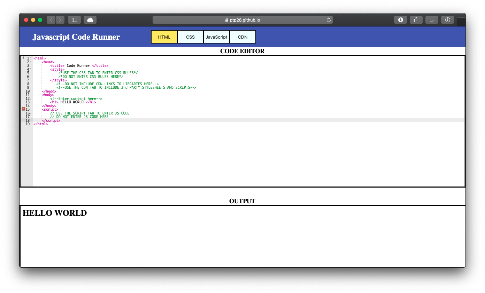
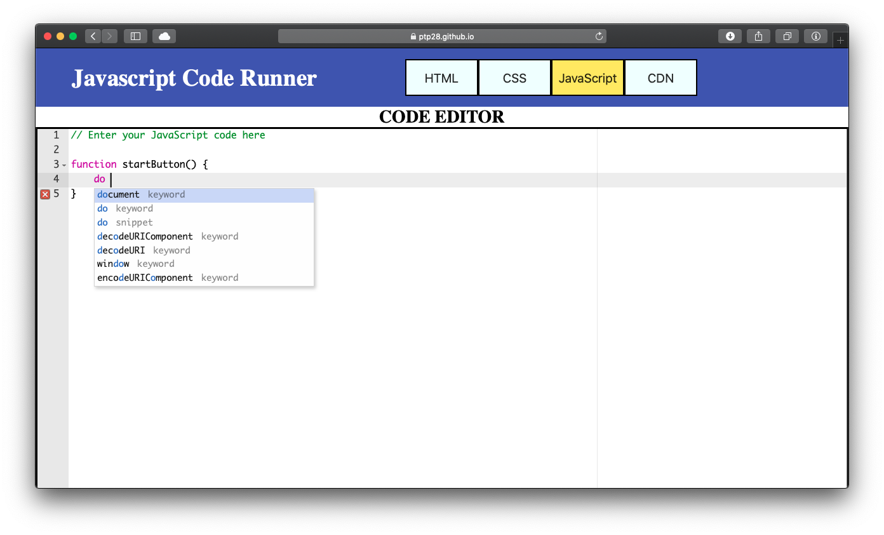
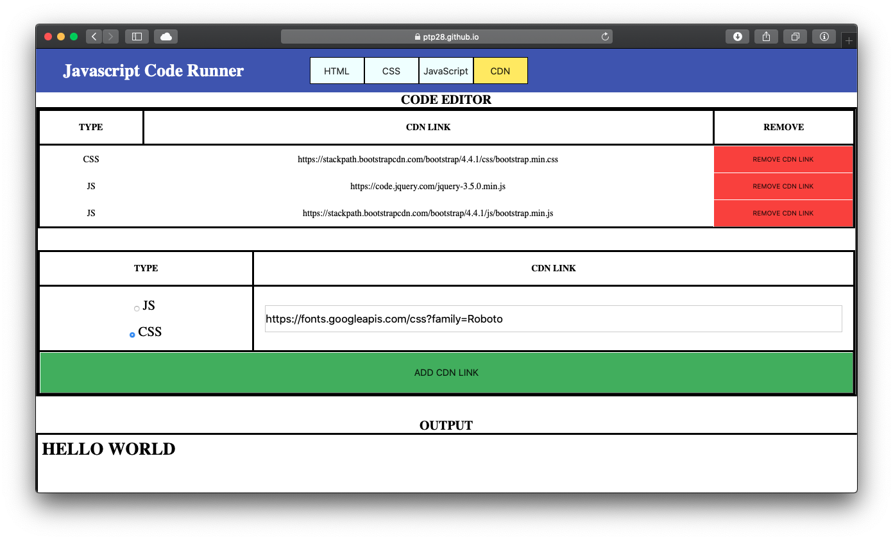
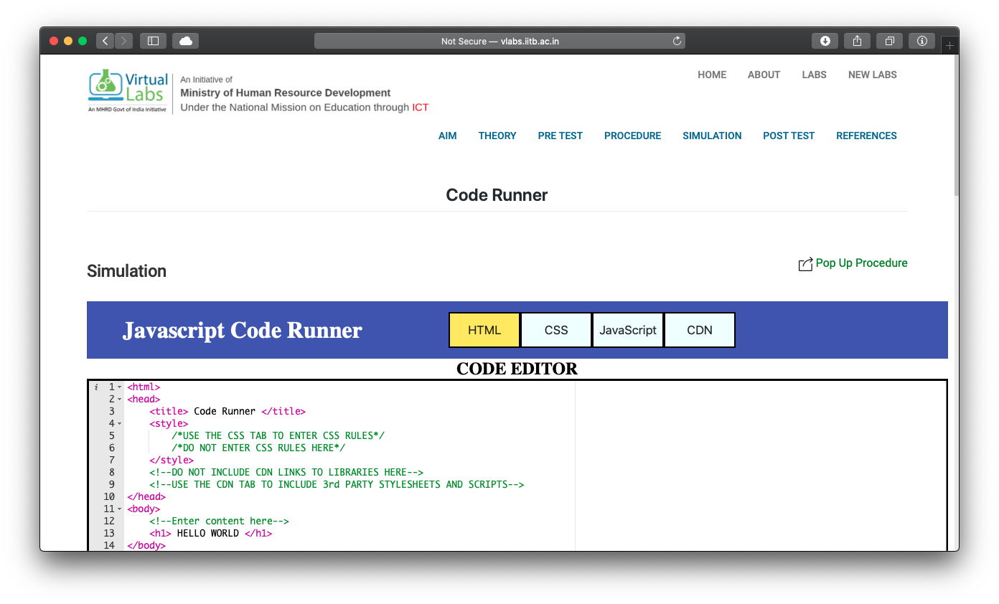

# Code-Runner
Online IDE for HTML-CSS-Javascript

Code Runner is an online web based IDE to practice coding HTML, CSS and Javascript.

It is meant to be a go-to editor when you want to try out some new idea without creating any files or opening any IDE on your computer.

Code Runner is also included as the last experiment is the [Javascript Virtual Lab](http://vlabs.iitb.ac.in/vlabs-dev/labs/javascript/index.php) hosted by IIT-Bombay.

## Features
- Online IDE.
- Ability to edit HTML, CSS and Javascript code.
- Immediate output.
- Smart sugestions and autocomplete.
- Ability to add 3rd party Javascript as well as CSS libraries using CDN links.
- Can open the output in New Tab.

## Screenshots
#### Main Page

#### Smart Suggestions and Autocomplete

#### CDN links

#### Part of Javascript Virtual Lab by IIT-Bombay

## References

Used the [ACE](https://ace.c9.io) library which can be found at - <https://github.com/ajaxorg/ace>.
